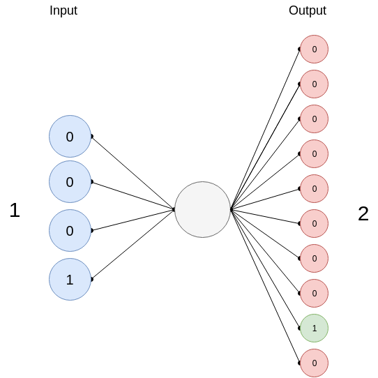

##### Requirements :

*   you need to have Python 2.7, you can work with Python 3 but there will be some small changes in syntax.  
    [https://www.python.org/downloads](https://www.python.org/downloads)
*   Numpy  
    [https://www.scipy.org/scipylib/download.html](https://www.scipy.org/scipylib/download.html)
*   matplotlib for visualization  
    [https://matplotlib.org/downloads.html](https://matplotlib.org/downloads.html)

In this quick post, we will learn how to build a Logistic regression model from scratch that learns how to count digits. The idea is that the model will learn how to count from 0 to 9 in binary; if you give it an input of 0100 (that's 4 in binary), it outputs a 0000010000 or a '5'; Since we have 10 possible classes (0 -> 9), our resulting output for one set of inputs may look like this \[0000000001\] or this \[1000000000\], if the output is 0.  

  
Ok, great now let's start coding.

  

First, we need a function that transforms decimal digits into binaries. For the inputs, a '1' will become a 0001 and for the outputs, a '1' will become a 0000000001. We use this function on train and test sets, to transform our data to binaries.

  

def transform\_to\_binary(X, y, dim, classes):
    m = len(X)
    bin\_X = np.zeros((dim, m))
    bin\_y = np.zeros((m, classes))
    # Tranform X to binary 1 of 4(dim) bits -> 0001
    for i in range(0, m):
        string = str(np.binary\_repr(X\[i\], width=dim))
        for j in range (0, dim):
            bin\_X\[j, i\] = string\[j\]

    # Transform y to binary 1 -> 0100000000
    temp = np.zeros((classes, ))
    for i in range(0, m):
        temp\[y\[i\]\] = 1
        bin\_y\[i, :\] = temp
        temp\[y\[i\]\] = 0
    return bin\_X, bin\_y    

  

Second, we define our activation function. In our case, we will use a sigmoid or logistic function. That will map any real number to a (0, 1) interval, to give us a probability of our output.

  

\# Activation function
def sigmoid(z):
    s = 1 / (1 + np.exp(-z))
    return s

  

Third, we initialize the parameters of the model with zeros, the biases b and the weights W.

  

\# Initialize our parameters (weights W and bias b with zeros) 
def initialize(dim, classes):
    w = None
    b = None
    w = np.zeros((dim, classes))
    b = np.zeros((1, classes))
    return w, b 

  

We define our cost function that compares the results of the hypothesis with inputs from X's and the actual output Y's. Our cost function is called cross entropy and looks like this:

  
$$Cost := - \\frac{1}{m} \\sum\_{i} ({y\_i \\log(\\hat{y\_i}) + (1-y\_i) \\log (1-\\hat{y\_i})})$$  

def cost\_function(A, y):
    m = np.shape(y)\[1\]
    J = 0
    # Reshape A and y from (1, 12) to (12, 1) : y and A must have the same shape
    y = y.T
    A = A.T
    J = J + ((-1./m) \* (np.dot(y.T, np.log(A)) + np.dot((1 - y).T, np.log(1 - A))))
    
    J = float(J)
    J = float("{0:.3f}".format(J))

    return J

  

And finally we implement 'propagate' that have 3 main functionalities:  
\-Calculate current loss through forward propagation  
\-Calculate current gradients through backward propagation  
\-Update parameters using gradient descent  
this is done inside two loops, one that loops through all the classes, we have 10 classes (0 -> 9) and the second is the number of iterations.

  

def propagate(X, y, dim, iter, l\_rate):
    m = np.shape(X)\[1\]
    classes = np.shape(y)\[1\]
    costs = \[\]
    all\_W, all\_b = initialize(dim, classes)

    for k in range(0, classes):
        temp\_y = y\[:, k\].reshape(1, np.shape(y\[:, k\])\[0\])
        W = all\_W\[:, k\].reshape(np.shape(all\_W\[:, k\])\[0\], 1)
        b = all\_b\[0, k\]

        for i in range(0, iter):

            # Forward probagation
            Z = np.dot(W.T, X) + b
            A = sigmoid(Z)
            # Save Cost
            costs.append(cost\_function(A, temp\_y))
            # Back probagation
            dZ = A - temp\_y
            dW = (1./m) \* (np.dot(X, dZ.T))
            db = (1./m) \* (np.sum(dZ))
            # Update
            W = W - l\_rate \* dW
            b = b - l\_rate \* db

        W = W.reshape(np.shape(W)\[0\],)
        all\_W\[:, k\] = W
        all\_b\[0, k\] = b
    #print all\_W
    #print all\_b
    return all\_W, all\_b, costs

  

##### Note:

In an ordinary logistic regression model, you'll have a binary classification in which the output is either 1 or 0, 'True' or 'False'. And because we have 10 output classes we are going to use something called **Multiclass Classification: One-vs-all**.  
Instead of y = {0,1} we will expand our definition so that y = {0,1...n}. Therefore, we divide our problem into n binary classification problems; in each one, we predict the probability that 'y' is a member of one of our classes. Think of it as if you're training not just one logistic regression model but 10 different one; each with its own set of parameters.  
How cool is that!

  

After the optimization process, we get all our weights and biases for the 10 different classes, we use them to predict our probability values and we choose the one with the highest probability. If you print all\_A, it will display a matrix with the number of examples as it's column count and 10 rows (since we have 10 classes (0->9)). for every column (or for every example in our test set), we pick the one with the highest probability using the `np.argmax` [(see numpy doc here).](https://docs.scipy.org/doc/numpy-1.13.0/reference/generated/numpy.argmax.html)

  

def predict(a, W, b, dim):
    all\_A =\[\]
    classes = np.shape(W)\[1\]
    bin\_a = np.zeros((dim, 1))
    # Convert a to binary
    string = np.binary\_repr(a, width=dim)

    for j in range (0, dim):
        bin\_a\[j\] = string\[j\]

    for k in range(0, classes):
        Z = np.dot(W\[:, k\].T, bin\_a) + b\[0, k\]
        A = sigmoid(Z)
        A = float(A)
        # Limiting to 3 decimal points
        A = float("{0:.3f}".format(A))
        all\_A.append(A)
    # print all\_A

    # Choose the index of the one with the highest probability

    return np.argmax(all\_A)

  
And that's it, we're done.  
We train our models using our train set.

train\_x = \[0, 1, 2, 3, 4, 5, 6, 7, 8, 9\]
train\_y = \[1, 2, 3, 4, 5, 6, 7, 8, 9, 0\]

First, transform them to binary using the transform\_to\_binary function. Then, the propagation and optimization process through the 'propagate' function. We give it a learning rate of 0.01 and a number of iterations of 1000.

W, b, costs = propagate(X, y, 4, 1000, 0.01)

  
We test it using our predict function.

print predict(1, W, b, 4)

If we give it a '1', it outputs a '2'.  
Awesome, it worked!  
  
Now let's test it on a set of numbers.  

def predict\_testSet(X, W, b):
    classes = np.shape(W)\[1\]
    m = np.shape(X)\[1\]
    all\_A = np.zeros((classes, m))

    for k in range(0, classes):
        Z = np.dot(W\[:, k\].T, X) + b\[0, k\]
        A = sigmoid(Z)

        # Limiting to 3 decimal points
        A = \[float("{0:.3f}".format(i)) for i in A\]
        all\_A\[k, :\] = A

    #print all\_A
    return np.argmax(all\_A, axis=0)

Results:*   Predicted Values: \[1 3 4 5 0 6\]
*   Real values: \[1, 3, 4, 5, 0, 6\]

The predicted values are similar to the real values of the test set.  
It looks Great.  
  
Now, we want it to count from a to b. If we give it a '2' for example, it will output \[2, 3, 4, 5, 6, 7, 8, 9\].  
  

def count(a, c, W, b, dim):
    numbers = \[\]
    i = predict(a, W, b, dim)

    if(a == c):
        return a

    if(a < c):
        numbers.append(a)
        numbers.append(i)
        while (i != c):
            i = predict(i, W, b, dim)
            numbers.append(i)
    return numbers

  
Now, let's visualize the learning curves to plot the costs through the iterations by using different learning rates.  
  

.png)

.png)

.png)

And that’s it! I hope I gave you a sense of how logistic regression actually works. You can find the whole code source in ([here](https://github.com/faresbs/Machine-learning-Applications/blob/master/Logistic%20regression/Logistic_regression_digit_count.py)).

## Connect with Me

Feel free to reach out or follow my work through the links below:
- [Email](mailto:farris.benslimane@gmail.com)
- [LinkedIn](https://www.linkedin.com/in/fares-ben-slimane/)
- [GitHub](https://github.com/faresbs)
